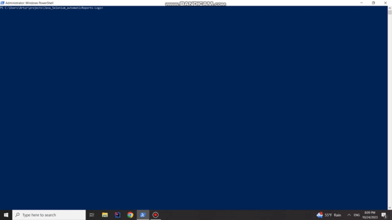

## Java_Selenium_automaticReports-Logs 📰
<pre>
<b>Check requirements & instruction for run this project locally or checkout samples bellow 🔽 <b>
</pre>
#### SUMMARY 📚

Welcome to my **CROSSWEB** Java-Selenium project for testing simple Web App.
Project is developed in **Page Object Model** pattern assisted by **Page Factory** framework.
<Pre></Pre>
### TECHNOLOGIES ✨💫
-  <b><i>Maven</b></i> -  bulding tool
-  <b><i>JAVA</b></i> -  main Language
-  <b><i>WebDriver</b></i> -  Selenium web framework that permits to execute cross-browser tests
-  <b><i>TestNG</b></i> -  testing framework that allows to perform automated testing
-  <b><i>Log4j2</b></i> -  to provide logging functionality
-  <b><i>ExtentReports</b></i>  -  library that allows creating interactive reports automatticly

</Pre>
  
### REQUIREMENTS 💂‍♂️
<pre>
- <b>Java version "17.0.9" </b> - installed and configurated
- <b>Apache Maven 3.9.5</b> - installed and configurated
- <b>Chrome Version 118.0.5993.89</b> 
- <b>Firefox Version 119.0 </b>
  
   <b>The rest of the frameworks and tools will be built from dependencies in pom.xml. </b>
</pre>

<h3>Instrucions ↩️</h3> to build locally  

- **clone this. repository using command:**
    <pre>git clone https://github.com/anowacki10/Java_Selenium_automaticReports-Logs.git</pre>
- **get to the repository PATH in cmd** <pre> "./Java_Selenium_automaticReports-Logs"</pre>
- **now you're abble to run tests using following commands** <pre>mvn clean test -DtestngName="smoke.xml"</pre> <pre>mvn clean test -DtestngName="testCases.xml"</pre>

  <i>   Test will be performed in the background, you will be able to track their results and the current status in the logs.</i>    After test executed you are abble to check resoults in: 

- logs <pre> ./src/logs/"TEST_NAME.log"   </pre>
- reports <pre> ./Reports/"BrowserName_Report_date.xml"</pre>

### CROSS BROWSING & RETRY TEST CONFIG 📋 
<pre>
You can find configuration file in ./src/test/resources/config.properties

<b>In "# aplication data" you can define exetuting browser:</b>
  
browser=chrome
or
browser=firefox

  
<b>In # Retry Analizer you can define Maximum Retry Tries of Failed tests</b>
  
retryCount=2

</pre>

## Samples 🙈 🙉 🙊
  Check a short GIF of ExtentReport overview, a sample Test execution or sample Test Case code.
  
- ### Report Overview
  
- ### Sample test execution
  
- - ### Sample Test Case
  
